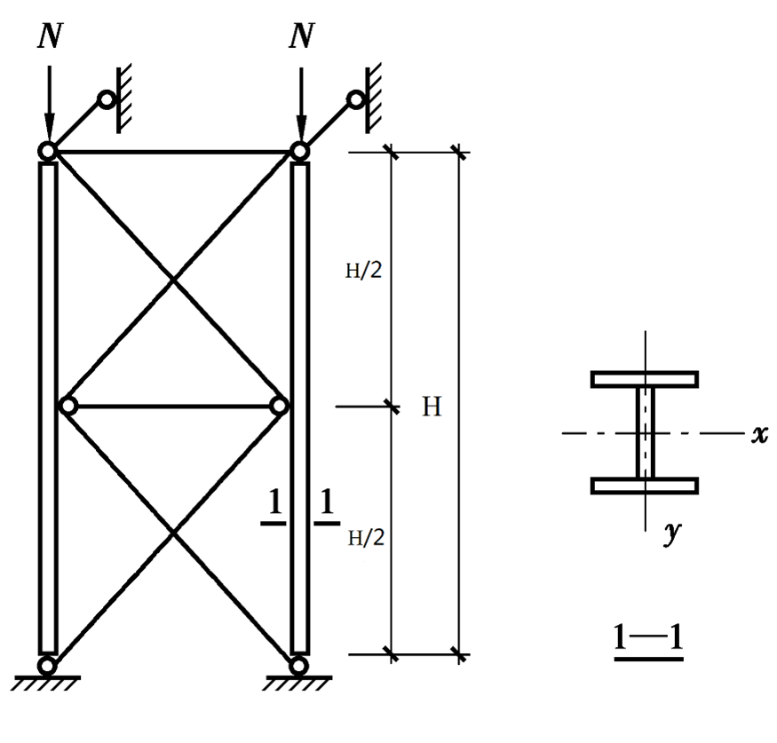

# Demo - 轴心受压构件设计

## 设计条件

设计如图所示两端铰接轴心受压柱，柱高 $ H={{ H }} \ \mathrm{mm} $ ，承受静力荷载设计值为 $ N={{ N }} \ \mathrm{kN} $ 。采用热轧H型截面。

## 关键结果验证

选用的热轧H型钢型号为 {{ input("ans_3_H_sec") }} 。（如`HW250×255`等，注意H和B是小类别里面的值，中间的`x`符号写小写的英语字母）

选用钢材为 {{ input("ans_3_Q") }} （如Q235等，不需要填写质量等级），钢材强度设计值 $f=$ {{ input("ans_3_f") }} $\mathrm{MPa}$ （注意厚度）。

**强度验算：**

没有削弱，强度不需要验算。

**刚度验算：**

 $ \lambda_x=$ {{ input("ans_3_lambda_x") }} $ < 150 $ ， $ \lambda_y=$ {{ input("ans_3_lambda_y") }} $ < 150 $ 。 

> 注意如果超过150将判为错误

**整体稳定：**

绕x轴的截面类别为 {{ input("ans_3_section_category_x") }} （填写 `a`、`b`、`c`或`d`），绕y轴的截面类别为 {{ input("ans_3_section_category_y") }} （填写 `a`、`b`、`c`或`d`）。

稳定系数 $ \varphi_{x}=$ {{ input("ans_3_phi_x") }} ，稳定系数 $ \varphi_{y}=$ {{ input("ans_3_phi_y") }} 。（插值保留三位小数）

整体稳定验算 $ \frac{N}{\varphi_{x} A f}=$ {{ input("ans_3_stability_check_x") }} $<1$， $ \frac{N}{\varphi_{y} A f}=$ {{ input("ans_3_stability_check_y") }} $<1$ 。

> 注意如果稳定验算不满足要求将判为错误

**局部稳定：**

翼缘宽厚比 {{ input("ans_3_b1_to_t") }} $ < $ {{ input("ans_3_b1_to_t_limit") }} 。
> 提示：翼缘的外伸宽度按翼缘宽度减去腹板厚度除以2计算。

腹板宽厚比 {{ input("ans_3_h_to_t") }} $ < $ {{ input("ans_3_h_to_t_limit") }} 。
> 提示：腹板净高为柱高减去上下翼缘厚度之和，再减去两个圆角的半径。
