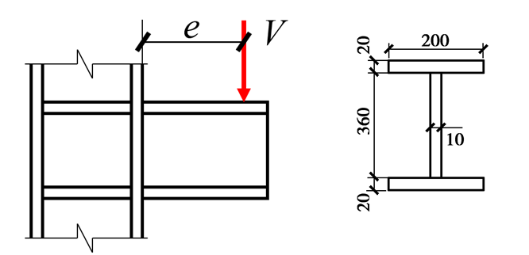

# 直角角焊缝牛腿连接设计

## 设计条件及设计要求

设计如图所示焊接工字型截面牛腿与柱的连接，牛腿承受静力荷载设计值为 $ V={{ V }} \ \mathrm{kN} $，偏心距 $ e=320 \ \mathrm{mm} $ ，柱和牛腿材料均为Q355B，柱翼缘板厚22 mm、腹板板厚12 mm，牛腿板件厚度见图。

图1 柱与牛腿连接示意

采用角焊缝实现牛腿和柱翼缘连接，要求设计所需直角焊缝。

## 设计步骤

弯矩大小为： $M = V \cdot e = $ {{ input("ans_M") }}  $ \mathrm{kN} \cdot \mathrm{mm} $ 。

最小焊脚尺寸为 {{ input("ans_h_min") }} mm，最大焊脚尺寸为 {{ input("ans_h_max") }} mm。

角焊缝强度为：
 $ f_{\mathrm{f}}^{\mathrm{w}} = $ {{ input("ans_f_fw") }} $ \mathrm{MPa} $

设计采用焊脚尺寸为 {{ input("ans_h") }} mm 的直角焊缝。

设焊缝为周边围焊，转角处连续施焊，没有起落弧所引起的焊口缺陷，计算时忽略工字形翼缘端部绕角部分焊缝，假定剪力仅由牛腿腹板焊缝承受。

腹板角焊缝有效面积为：
 $ A_{\mathrm{w}} = $ {{ input("ans_A_w") }} $ \mathrm{mm}^2 $

全部焊缝的惯性矩为：
 $ I_{\mathrm{x}} = $ {{ input("ans_I_x") }} $ \mathrm{mm}^4 $

弯矩作用下焊缝翼缘边缘的最大拉应力为 $ \sigma_{\mathrm{f}} = $ {{ input("ans_sigma_f") }} $ \mathrm{MPa} < $ {{ input("ans_f_fw") }} $ \mathrm{MPa} $，满足要求。

剪力作用下腹板焊缝的切应力为：
 $ \tau_{\mathrm{f}} = $ {{ input("ans_tau_f") }} $ \mathrm{MPa} $

在牛腿翼缘和腹板交界处，存在弯矩引起的正应力和剪力引起的剪应力，其正应力为: $ \sigma_{\mathrm{f}}' = $ {{ input("ans_sigma_f_prime") }} $ \mathrm{MPa} $

焊缝强度验算：
 $ \sqrt{(\sigma_{\mathrm{f}}'/\beta_{\mathrm{f}})^2 + \tau_{\mathrm{f}}^2} = $ {{ input("ans_combined_stress") }} $ \mathrm{MPa} < $ {{ input("ans_f_fw") }} $ \mathrm{MPa} $，满足要求。
